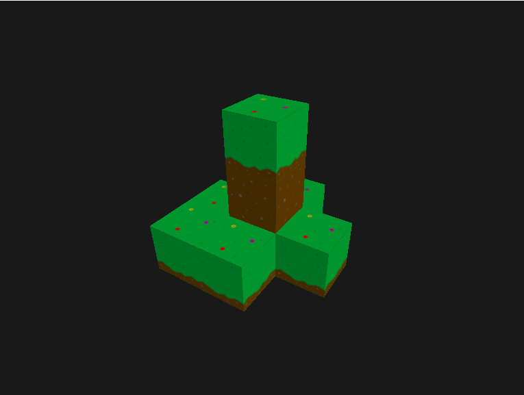
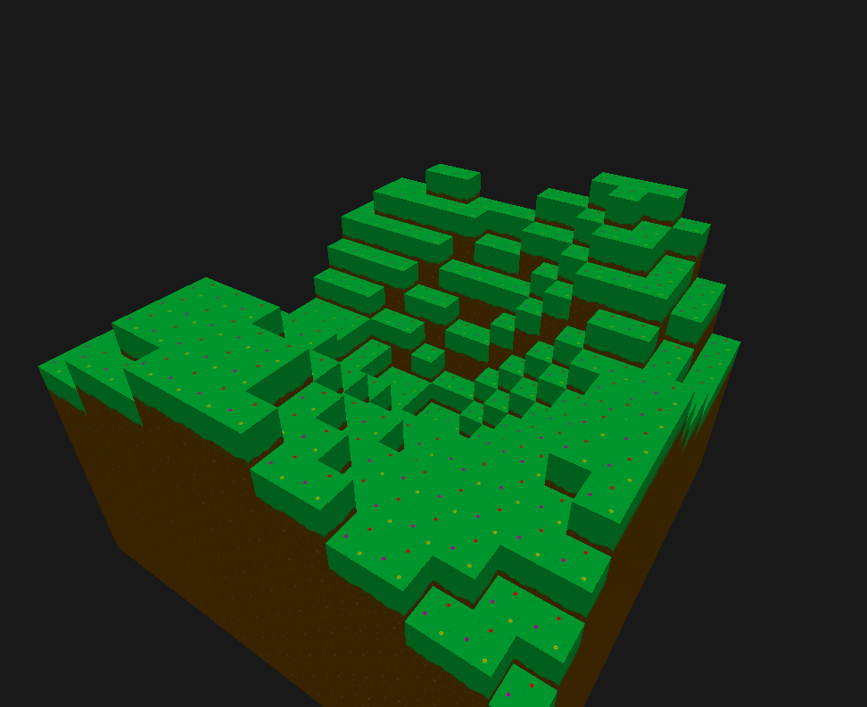
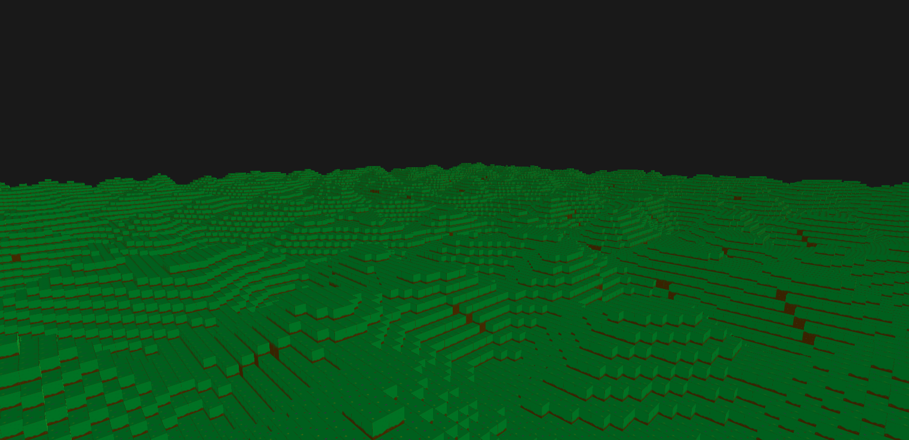

<h1>Blockzone </h1>

----
## Table of Contents
[Rendering](#rendering)
[Async Chuck Loading](#async-chuck-loading)
[Async Logger](#async-logger)
[Improving Modularity](#improving-modularity)

## Rendering

This is an open world voxel game I am developing using C++ and OpenGL.

I started out by learning how to work with OpenGL and was able to render some simple blocks.

To make something out of these blocks I used a noise function to generate a height map to created simple procedual rolling hills.

My first approcah at rendering the blocks and chunks was very inefficient, there was serious lag with only 4 chunks! To fix this, I added a geometry shader in my rendering pipeline so I could pass in 1 vertex with a normal and it would generate the 2D plane on the graphics card. This reduced the amount of data I needed to pass to the GPU from 4 vertices each with 8 floats of data to 1 vertex. I also added a step to generate a mesh for each chunk which would only need to updated if the chunk was changed. These 2 steps made it so I could easily have 16 by 16 chunks with no lag.

Collision detection has since been added to the blocks to allowing the player to walk and jump through the world.

## Async Chuck Loading

The idea is to maintain a few loaded chunks arround the player at all times. Doing this in the same thread that is rendering will cause a massive lag spike everytime a player moves from one chunk to another.

To remove any performance impacts, the task of loading new chunks was split off into a new thread. When a player crosses a chunk boundary, it spinds up a new thread that is incharge or loading the new chunks. It creates a copy of the current chunks, and starts new threads to load each chunk from the hard drive or generate it if it doesn't already exist. Once all the new chunks have been loaded, it sends the new chunks back to the rendering thread to it will render them. After this, it goes through all the chunks that need to be unloaded. It then starts new threads to save the chunks to the hard drive and unload their memory.

## Async Logger

For this implemenation, there is a static function to log which takes a message, severity level, and file. This function will acquire the approriate mutexes, wake a worker thread, and add the log data to a queue in shared memory. This way the thread logging does minimal work and suffers a very smaller performance penalty. 

There can be any number of worker threads to log the messages. They will wait to be woken up and check if the queue contains anything. Logging the message in all the approriate log files depending on severity level. Then it will continue to write the messages to the log files until the queue is empty, then it waiting on a signal.

When shutting down. A shutdown signal will be sent to all the worker threads, allowing them to be shutdown.

This allows for large debug logs to be written without negatively impacting performance.

Then all that is needed is to define a macro in each cpp file that calls the static log function and uses a compile time flag to get the file.

## Improving Modularity

Continous work is being done to improve the modularity of the code to allow for easier future expansion.

The texture loader has been updated to use a modular approach. The textures are loaded from a image that has a grid of textures. These textures are of a known size. The size of the textures is defined in a JSON file. It uses that and then size of the textures image to grab each texture off of the grid and to add it to OpenGL. This makes adding new textures much faster and easier.

### Dependiencies
- C++
- OpenGL 3.3
- GLFW (OpenGL Library)
- GLEW (OpenGL Library)
- SOIL2 (for loading textures)
- GLM (for advanced vector and matrix math)